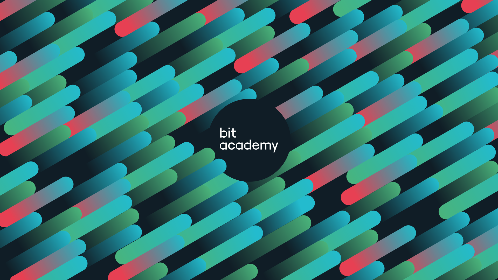

<h2>Hi there 👋<h2>
<h3>My name is Sueda Herdem, I'm currently in my second year of my study as a software developer at bit academy. I learn how to program with different languages and techniques.<h3>
<h2>💻I'm currently learning:<h2/>
- JavaScript  
- Python 
- PHP 
- HTML/CSS 
- Visualisation in Pyhton 
- Working with SQL and MySQL on databases
 
<h2>📫  How to reach me:<h2>

 

